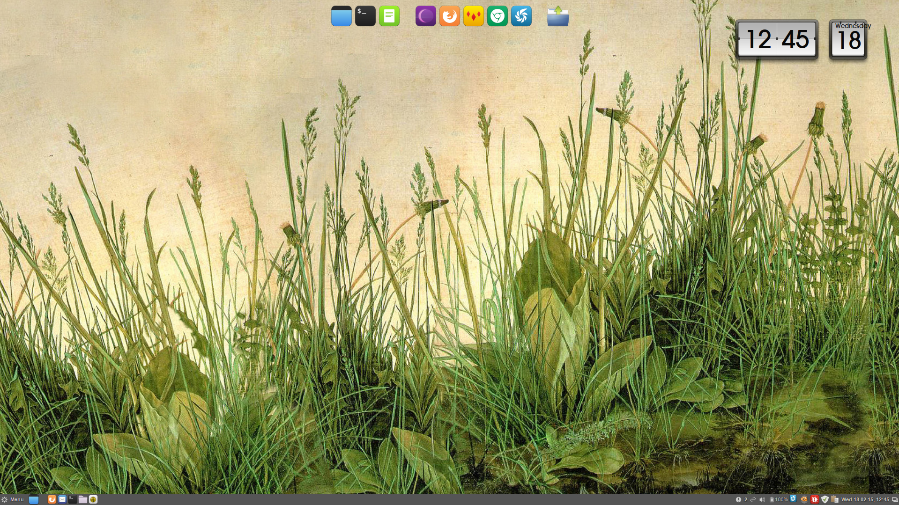

Backup of [Cairo dock] theme for Fedora/Cinnamon. I don't think this is much useful for other users. I am just tired of customising this every time again when setting up a new machine.

* Caro-Dock 3.4.0
* Based on the excellent Humanity-Dock theme by Andrea Calabrò (MastroPino).

### Install

* place in ~/.config/cairo-dock/themes

Screenshots: Fedora 20/Cinnamon
